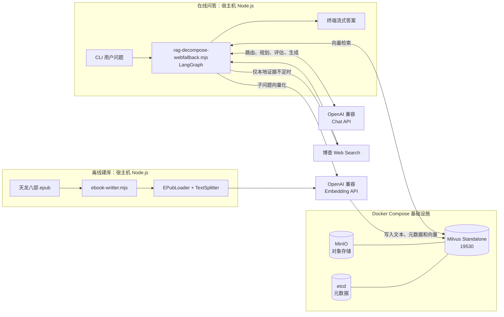
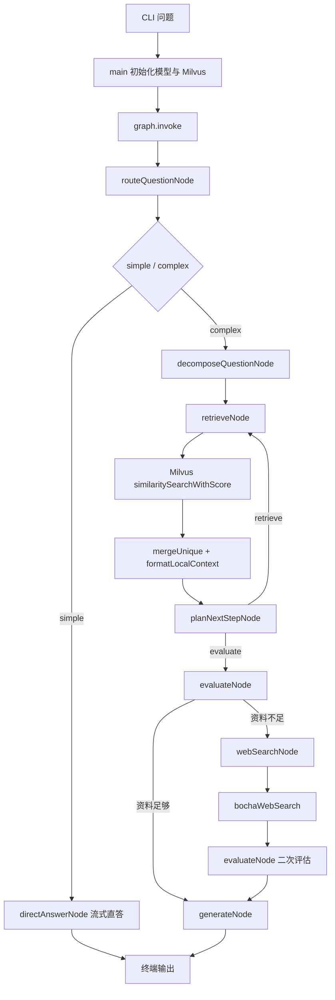

# Agentic-RAG

基于 Node.js、LangGraph 和 Milvus 的《天龙八部》智能问答项目。系统支持复杂问题拆解、多轮向量检索、检索结果去重、证据充分性评估，以及本地知识不足时的博查联网搜索兜底。

这是一个面试与学习用途的 CLI 项目：Docker Compose 负责运行 Milvus 基础设施，Node.js 脚本在宿主机执行数据入库和问答工作流。

## 核心能力

- 将 EPUB 小说按章节加载，再切分为带重叠的文本片段。
- 使用 1024 维 Embedding 将文本写入 Milvus。
- 使用 LangGraph 管理状态、条件路由和多轮检索循环。
- 将复杂问题拆成 1～8 个有序子问题，逐个执行向量检索。
- 合并多轮召回结果，按文档 ID 去重并保留更高相似度分数。
- 使用结构化输出判断证据是否完整，而不是只依赖固定相似度阈值。
- 本地证据不足时调用博查 Web Search，并在最终答案中保留 URL。
- 最终答案通过终端流式输出。

## 系统架构



### Docker 的职责边界

`backend/docker/milvus-docker/milvus-standalone-docker-compose.yml` 只部署以下数据基础设施：

| 服务 | 用途 | 宿主机端口 |
| --- | --- | --- |
| `standalone` | Milvus 向量数据库 | `19530`、`9091` |
| `etcd` | 保存 Milvus 元数据 | 未暴露 |
| `minio` | 保存 Milvus 对象数据 | `9000`、`9001` |

Node.js RAG 应用没有被容器化，也没有 Web UI 或 HTTP API。模型服务和博查搜索均为外部 API。

## 技术栈

| 分类 | 技术 | 项目中的用途 |
| --- | --- | --- |
| 运行时 | Node.js 22+、ES Modules | 执行建库和问答脚本 |
| 包管理 | pnpm | 安装和锁定依赖 |
| 工作流编排 | LangGraph.js | 状态、节点、条件边和循环 |
| LLM 集成 | `@langchain/openai` | Chat Model、结构化输出和 Embedding |
| 向量数据库 | Milvus | 文本向量存储与相似度检索 |
| 数据加载 | `EPubLoader` | 按章节读取 EPUB |
| 文本切分 | `RecursiveCharacterTextSplitter` | 500 字符切块、50 字符重叠 |
| 数据校验 | Zod | 约束路由、拆解、规划和评估输出 |
| 联网搜索 | 博查 Web Search API | 本地知识不足时补充外部资料 |
| 基础设施 | Docker Compose、etcd、MinIO | 运行并持久化 Milvus Standalone |

## 项目目录

```text
Agentic-RAG/
├─ README.md                              # 当前文档
├─ .gitignore
├─ backend/
│  └─ docker/
│     ├─ milvus-docker/
│     │  ├─ milvus-standalone-docker-compose.yml
│     │  ├─ volumes/                      # Docker 本地运行数据
│     │  ├─ index.mjs                     # 独立的 Milvus 日记示例，不属于主链路
│     │  └─ readme.md
│     └─ demo/                            # Node + Nginx 学习示例，不属于主链路
└─ agentic-rag/
   └─ advance-rag/
      ├─ 天龙八部.epub                     # 本地知识库原始文件
      ├─ package.json
      ├─ pnpm-lock.yaml
      ├─ Final-RAG.md                     # LangGraph 流程图
      ├─ plan-src/                        # 合并前的参考脚本
      │  ├─ rag-multiple.mjs
      │  └─ rag-webfallback.mjs
      └─ src/
         ├─ ebook-writter.mjs             # EPUB 切分、向量化并写入 Milvus
         └─ rag-decompose-webfallback.mjs # 主问答工作流
```

`backend/docker/demo/` 和 `backend/docker/milvus-docker/index.mjs` 是独立学习示例，运行主 RAG 项目时不需要执行。

## 前置要求

- Docker Desktop 或兼容的 Docker Engine，并支持 `docker compose`。
- Node.js 22 或更高版本。
- pnpm。
- 一个支持 Chat、流式输出和结构化输出的 OpenAI 兼容模型服务。
- 一个支持 `text-embedding-v3`、1024 维输出的 Embedding 服务。
- 博查 API Key：只有进入联网兜底分支时才会使用。

## 快速开始：从 Docker 到答案输出

以下命令默认从仓库根目录执行。

### 1. 启动 Milvus

```bash
docker compose -f backend/docker/milvus-docker/milvus-standalone-docker-compose.yml up -d
```

首次启动需要拉取 Milvus、etcd 和 MinIO 镜像。检查容器状态：

```bash
docker compose -f backend/docker/milvus-docker/milvus-standalone-docker-compose.yml ps
```

如需查看 Milvus 日志：

```bash
docker compose -f backend/docker/milvus-docker/milvus-standalone-docker-compose.yml logs -f standalone
```

等待 `standalone`、`etcd` 和 `minio` 正常运行后再继续。

### 2. 安装 Node.js 依赖

后续命令必须在 `agentic-rag/advance-rag` 中执行，因为 `.env` 和 `./天龙八部.epub` 都按照当前工作目录读取。

```bash
cd agentic-rag/advance-rag
pnpm install
```

### 3. 配置环境变量

在 `agentic-rag/advance-rag/.env` 中写入：

```dotenv
# Chat Model
OPENAI_MODEL_NAME=你的聊天模型名称
OPENAI_API_BASE_URL=你的OpenAI兼容接口地址
OPENAI_API_KEY=你的模型服务密钥

# 本地资料不足时使用
BOCHA_API_KEY=你的博查API密钥

# 以下配置只被主问答脚本读取，可不填写
MILVUS_URL=localhost:19530
MILVUS_COLLECTION_NAME=ebook_collection
RAG_TOP_K=5
RAG_MAX_RETRIEVALS=8
```

不要将 `.env` 或真实 API Key 提交到 Git。

### 4. 首次构建知识库

如果 `ebook_collection` 尚未写入《天龙八部》数据，执行一次：

```bash
node src/ebook-writter.mjs
```

该脚本会：

1. 连接 `localhost:19530`。
2. 创建或加载 `ebook_collection`。
3. 按章节读取 `天龙八部.epub`。
4. 将每章切成 500 字符、重叠 50 字符的片段。
5. 为每个片段生成 1024 维向量。
6. 按章节批量写入 Milvus。

脚本使用固定主键，同一份 EPUB 不是幂等导入。如果集合中已经存在这些数据，不要直接重复运行，否则可能出现主键冲突。

### 5. 运行问答

使用脚本内置示例问题：

```bash
node src/rag-decompose-webfallback.mjs
```

传入自定义问题：

```bash
node src/rag-decompose-webfallback.mjs "《天龙八部》中四大恶人排行第二的是谁？她的儿子是谁，生父公开身份是什么？"
```

测试本地知识加联网兜底：

```bash
node src/rag-decompose-webfallback.mjs "《天龙八部》中叶二娘的儿子和其生父分别是谁？2013版电视剧在哪几集揭晓这段身世？请给出来源链接。"
```

### 6. 停止 Milvus

回到仓库根目录后执行：

```bash
docker compose -f backend/docker/milvus-docker/milvus-standalone-docker-compose.yml down
```

这里不使用 `down -v`，因此不会主动删除持久化数据。

## 离线知识库构建流程

`src/ebook-writter.mjs` 的调用链：

```text
main
├─ client.connectPromise
├─ ensureCollection
│  ├─ hasCollection
│  ├─ createCollection（首次）
│  ├─ createIndex（首次）
│  └─ loadCollection
└─ loadAndProcessEPubStreaming
   ├─ EPubLoader.load
   ├─ RecursiveCharacterTextSplitter.splitText
   └─ insertChunksBatch
      ├─ getEmbedding / embeddings.embedQuery
      └─ client.insert
```

### Milvus Schema

| 字段 | 类型 | 说明 |
| --- | --- | --- |
| `id` | `VarChar` | 主键 |
| `book_id` | `VarChar` | 图书 ID |
| `book_name` | `VarChar` | 图书名称 |
| `chapter_num` | `Int32` | 章节号 |
| `index` | `Int32` | 章节内片段序号 |
| `content` | `VarChar` | 文本片段 |
| `vector` | `FloatVector(1024)` | 文本向量 |

当前写库脚本创建 `IVF_FLAT + COSINE` 索引，`nlist=1024`。Embedding 模型、输出维度、Milvus Schema 和查询端必须保持一致。

## 在线问答执行流程



### 关键执行规则

1. `routeQuestionNode()` 把无需小说细节的问题路由到直接回答，其余问题进入 RAG。
2. `decomposeQuestionNode()` 一次生成 1～8 个有序子问题。
3. `retrieveNode()` 每轮处理一个子问题，默认召回 Top 5。
4. `mergeUnique()` 按文档 ID 去重，相同 ID 保留更高分结果。
5. `planNextStepNode()` 决定继续检索还是评估，默认最多执行 8 轮检索。
6. `evaluateNode()` 返回 `enough`、`missing`、`reason` 和可选 `web_query`。
7. 本地资料不足时，博查默认返回最多 8 条联网结果。
8. 联网后再次评估，但不再次联网，避免死循环和费用失控。
9. `generateNode()` 综合本地与联网资料，通过标准输出流式回答。

当前实现会在进入 LangGraph 路由前连接 Milvus，所以即使问题最后被判定为 `simple`，Milvus 也必须已经启动。

## 运行时输出

主脚本会依次输出：

1. LangGraph 的 Mermaid 图源码。
2. Milvus 连接与 Collection 加载状态。
3. 问题路由结果。
4. 子问题列表。
5. 每轮检索命中数、分数、章节、片段序号和内容预览。
6. 是否继续检索的规划结果。
7. 本地或本地加联网的充分性评估。
8. 可选的联网查询及结果长度。
9. `[AI 回答（流式）]` 和最终答案。

典型日志结构如下，实际内容由模型和检索结果决定：

```text
graph TD;
...
连接到 Milvus...
集合已经加载
___ROUTE-QUESTION___
路由策略：complex ...
---DECOMPOSE_QUESTION---
[1] ...
[2] ...
----第 1 轮，子问题 1/2---
本轮命中 5 条，累计去重后 5 条
---PLAN_NEXT_STEP---
...
---EVALUATE_LOCAL_CONTEXT---
...
---WEB_SEARCH---                 # 仅资料不足时出现
...
[AI 回答（流式）]
最终答案...
```

输出目前只显示在终端；项目没有把最终状态保存到数据库或文件。

## 配置说明

| 环境变量 | 是否必需 | 默认值 | 作用范围 |
| --- | --- | --- | --- |
| `OPENAI_MODEL_NAME` | 是 | 无 | 主问答脚本的 Chat Model |
| `OPENAI_API_BASE_URL` | 通常是 | 服务默认值 | 建库和问答使用的兼容接口地址 |
| `OPENAI_API_KEY` | 是 | 无 | Chat 和 Embedding 鉴权 |
| `BOCHA_API_KEY` | 条件必需 | 无 | 进入联网兜底时使用 |
| `MILVUS_URL` | 否 | `localhost:19530` | 仅主问答脚本 |
| `MILVUS_COLLECTION_NAME` | 否 | `ebook_collection` | 仅主问答脚本 |
| `RAG_TOP_K` | 否 | `5` | 每个子问题的召回数量 |
| `RAG_MAX_RETRIEVALS` | 否 | `8` | 最大本地检索轮数 |

注意：`src/ebook-writter.mjs` 当前将 EPUB 路径、Milvus 地址、集合名称、Embedding 模型和维度写在源码中；`MILVUS_URL` 与 `MILVUS_COLLECTION_NAME` 只影响主问答脚本。修改查询端配置时，需要同步保证写库端与查询端指向同一集合。

## 常见问题

### `docker` 命令不存在

安装并启动 Docker Desktop，重新打开终端后确认：

```bash
docker --version
docker compose version
```

### 无法连接 `localhost:19530`

检查容器状态与 Milvus 日志：

```bash
docker compose -f backend/docker/milvus-docker/milvus-standalone-docker-compose.yml ps
docker compose -f backend/docker/milvus-docker/milvus-standalone-docker-compose.yml logs standalone
```

### 找不到 `ebook_collection`

确认当前目录是 `agentic-rag/advance-rag`，然后首次执行：

```bash
node src/ebook-writter.mjs
```

### 出现向量维度不匹配

写库和查询必须使用同一个 Embedding 模型和 1024 维向量。更换模型或维度后，需要使用匹配的新 Collection Schema 和向量数据。

### 提示 `BOCHA_API_KEY` 未配置

本地证据不足时才会触发该错误。在 `.env` 中配置博查 API Key 后重新启动脚本。

### 重复导入时报主键冲突

当前主键由书籍、章节和片段序号固定生成，导入流程不是 upsert。已有完整数据时跳过建库步骤；如果需要重新建库，应先设计明确的数据迁移或重建流程。

### 模型无法返回结构化结果

确保所使用的 OpenAI 兼容模型支持当前 LangChain 的 structured output 调用方式，否则路由、拆解、规划或评估节点可能失败。

## 当前边界与后续优化

- Docker Compose 只部署 Milvus 基础设施，Node.js 应用尚未容器化。
- 当前是 CLI 项目，没有 HTTP API、Web UI、用户会话和权限控制。
- 没有自动化测试、检索评测、答案评测、链路追踪、超时和重试策略。
- EPUB 导入流程不是幂等操作，文件路径和多项数据库配置仍为硬编码。
- 写库端创建 `IVF_FLAT` 索引，而主问答脚本保留 HNSW/`ef` 查询配置，两端索引和搜索参数尚未完全统一；面试演示前应统一配置并完成端到端验证。
- `simple` 分支直接使用模型回答，没有引用本地或联网证据。
- 当前多跳实现是“一次性拆出有序子问题后逐个检索”，还不是根据上一跳答案动态生成下一跳查询。
- `package.json` 暂无 `start`、`ingest` 等快捷脚本，`test` 仍为占位命令。

适合后续补充的能力：统一索引参数、增加 rerank、加入每个子问题的证据覆盖规则、增加 API 层、补充测试与 LangSmith 可观测性、将 Node 应用一起容器化。

## 相关资料

README 的组织方式参考了成熟开源项目常用的“能力 → 架构 → Quick Start → 配置 → 执行流程 → 排错 → 边界”结构：

- [LangGraph.js](https://github.com/langchain-ai/langgraphjs)
- [LangGraph.js 项目模板](https://github.com/langchain-ai/new-langgraphjs-project)
- [Milvus](https://github.com/milvus-io/milvus)
- [Milvus Node.js SDK](https://github.com/milvus-io/milvus-sdk-node)
- [Milvus Workshop](https://github.com/milvus-io/milvus-workshop)
- [Vector Graph RAG](https://github.com/zilliztech/vector-graph-rag)
