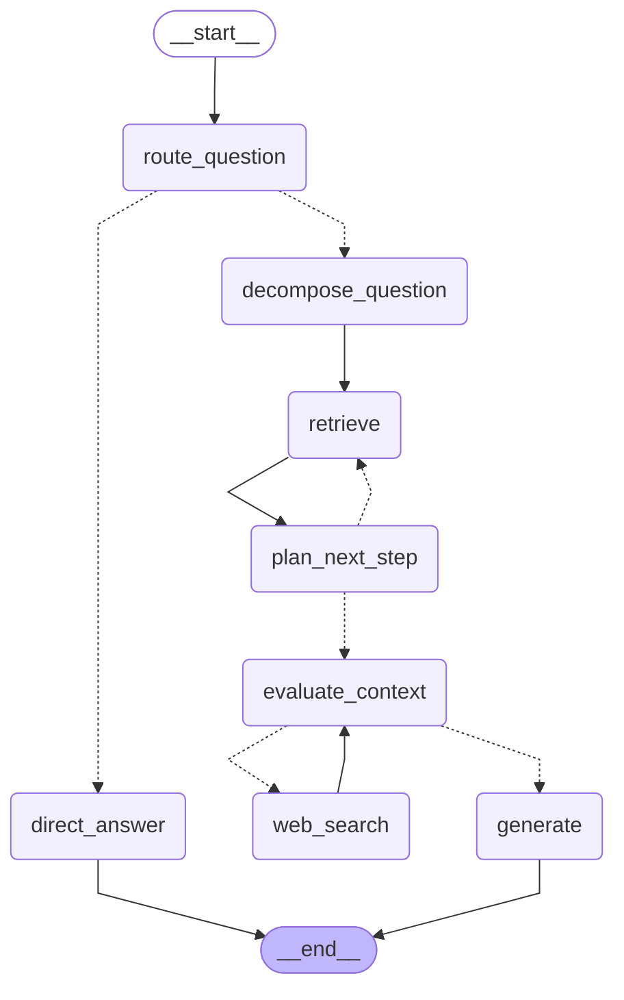

```mermaid
%%{init: {'flowchart': {'curve': 'linear'}}}%%
graph TD;
        __start__([<p>__start__</p>]):::first
        route_question(route_question)
        direct_answer(direct_answer)
        decompose_question(decompose_question)
        retrieve(retrieve)
        plan_next_step(plan_next_step)
        evaluate_context(evaluate_context)
        web_search(web_search)
        generate(generate)
        __end__([<p>__end__</p>]):::last
        __start__ --> route_question;
        decompose_question --> retrieve;
        direct_answer --> __end__;
        generate --> __end__;
        retrieve --> plan_next_step;
        web_search --> evaluate_context;
        route_question -.-> direct_answer;
        route_question -.-> decompose_question;
        plan_next_step -.-> retrieve;
        plan_next_step -.-> evaluate_context;
        evaluate_context -.-> generate;
        evaluate_context -.-> web_search;
        classDef default fill:#f2f0ff,line-height:1.2;
        classDef first fill-opacity:0;
        classDef last fill:#bfb6fc;
```