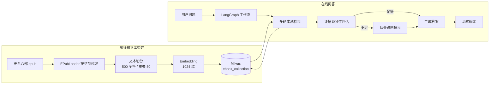
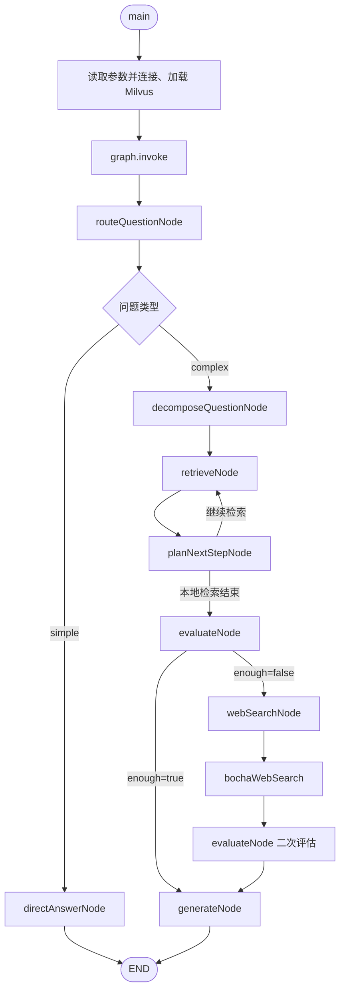

# Agentic RAG 面试讲解手册

这份文档用于面试时讲解项目。项目主入口是 `src/rag-decompose-webfallback.mjs`，完整部署和运行命令见仓库根目录的 `README.md`。

## 一句话介绍

这是一个面向《天龙八部》知识问答的 Agentic RAG：先把 EPUB 小说切分并向量化到 Milvus，再用 LangGraph 编排问题路由、复杂问题拆解、多轮检索、证据充分性评估和答案生成；本地知识不足时，只调用一次博查 Web Search 补充外部资料。

## 30 秒项目介绍

传统 RAG 通常把完整问题只检索一次。复杂问题包含多个事实时，单个查询向量容易只召回其中一个方面，造成答案不完整。这个项目使用大模型把复杂问题拆成 1～8 个有序子问题，逐个查询 Milvus，把多轮结果按文档 ID 去重，再判断证据是否覆盖原问题。如果小说知识库不能回答电视剧集数等外部信息，工作流会生成更合适的联网查询，通过博查搜索补充资料，最后综合本地片段和带 URL 的联网结果流式回答。

## 整个项目分为两条流程



### 1. 离线建库流程

入口文件是 `src/ebook-writter.mjs`，函数调用链如下：

```text
main()
├─ 连接 Milvus
├─ ensureCollection()
│  ├─ hasCollection()
│  ├─ createCollection()        # 首次运行时创建 ebook_collection
│  ├─ createIndex()             # IVF_FLAT + COSINE
│  └─ loadCollection()
└─ loadAndProcessEPubStreaming()
   ├─ EPubLoader.load()         # 按章节加载 EPUB
   ├─ RecursiveCharacterTextSplitter.splitText()
   └─ insertChunksBatch()
      ├─ getEmbedding()         # 每个文本片段生成 1024 维向量
      └─ client.insert()        # 按章节批量写入 Milvus
```

知识库中的每条记录包含：

| 字段 | 含义 |
| --- | --- |
| `id` | 主键，格式为 `bookId_章节号_片段号` |
| `book_id` / `book_name` | 图书标识和书名 |
| `chapter_num` | 章节号 |
| `index` | 片段在章节中的序号 |
| `content` | 原始文本片段 |
| `vector` | 1024 维文本向量 |

### 2. 在线问答流程

主入口是 `src/rag-decompose-webfallback.mjs`：



> 即使问题最终走 `simple` 分支，当前 `main()` 也会在进入 LangGraph 前连接并加载 Milvus，因此运行程序时仍需要启动 Milvus。

## 主要函数是怎么配合的

| 函数 | 作用 | 关键输入 | 关键输出 |
| --- | --- | --- | --- |
| `main()` | 读取 CLI 问题和配置，初始化 Milvus，启动状态图 | CLI 参数、环境变量 | `graph.invoke()` 初始状态 |
| `parsePositiveInteger()` | 解析 Top K 和最大检索轮数 | 环境变量字符串、默认值 | 正整数配置 |
| `routeQuestionNode()` | 判断直接回答还是进入 RAG | `state.question` | `strategy`、`routeReason` |
| `directAnswerNode()` | 简单问题直接流式回答 | 原始问题 | `generation` |
| `decomposeQuestionNode()` | 将复杂问题拆为 1～8 个有序子问题 | 原始问题 | `subQuestions` |
| `retrieveRelevantContent()` | 调用 Milvus 相似度搜索 | 当前子问题、`k` | 文档与相似度分数 |
| `retrieveNode()` | 执行一轮检索并推进子问题下标 | 当前图状态 | 合并后的 `documents` |
| `mergeUnique()` | 按文档 ID 合并多轮结果，同 ID 保留更高分 | 旧文档、新文档 | 去重并排序后的文档 |
| `formatLocalContext()` | 把文档数组整理成提示词可用的字符串 | 文档数组 | `localContext` |
| `planNextStepNode()` | 判断继续检索还是开始评估 | 子问题进度、召回摘要、轮数 | `plannedNext` |
| `evaluateNode()` | 判断现有资料能否完整回答原问题 | 原问题、本地及可选联网上下文 | `enough`、`missing`、`web_query` |
| `webSearchNode()` | 选择联网查询并调用搜索封装 | 评估结果 | `webContext` |
| `bochaWebSearch()` | 请求博查 Web Search API 并格式化来源 | 查询语句 | 标题、URL、摘要等 |
| `generateNode()` | 综合证据并流式生成最终回答 | 本地、联网上下文 | `generation` |

## 小例子：一次复杂问题如何执行

示例问题：

> 《天龙八部》中四大恶人排行第二的是谁？她的儿子是谁、生父在武林中的公开身份是什么？另外，2013 版电视剧在哪几集揭晓这段身世？请给出可核对的链接。

下面是示意流程。子问题的实际文字和数量由模型决定，每次运行可能略有不同。

### 第 1 步：启动工作流

```text
main()
└─ graph.invoke({ question, k: 5, maxRetrievals: 8, ... })
```

`main()` 先连接 `ebook_collection`，随后把问题和初始状态传入 LangGraph。

### 第 2 步：问题路由

```text
routeQuestionNode()
└─ RouteSchema: { strategy: "complex", reason: "需要小说人物关系和剧集资料" }
```

`afterRoute()` 读取 `strategy`，把复杂问题送到 `decomposeQuestionNode()`。

### 第 3 步：拆解问题

`decomposeQuestionNode()` 可能生成：

```text
1. 《天龙八部》四大恶人排行第二的人物是谁？
2. 叶二娘的儿子是谁？
3. 叶二娘儿子的生父是谁，其公开身份是什么？
4. 2013 版《天龙八部》在哪几集揭晓虚竹身世？
```

Zod 的 `DecomposeSchema` 把输出限制为 1～8 个字符串，减少模型返回无法被工作流解析的自由文本。

### 第 4 步：逐个检索并合并结果

每一轮调用：

```text
retrieveNode()
├─ 从 subQuestions[nextSubIdx] 取当前问题
├─ retrieveRelevantContent(query, k)
│  └─ vectorStore.similaritySearchWithScore(query, k)
├─ mergeUnique(state.documents, newDocs)
└─ formatLocalContext(merged)
```

小说人物、亲子关系和公开身份通常能在 EPUB 知识库中命中；电视剧集数不属于小说原文，本地可能没有有效证据。

### 第 5 步：控制多轮检索

每轮检索后执行 `planNextStepNode()`：

- 仍有关键子问题且未达到 `maxRetrievals`：`plannedNext=retrieve`，回到 `retrieveNode()`。
- 证据已经足够、子问题用完或达到轮数上限：`plannedNext=evaluate`，进入 `evaluateNode()`。

除了模型判断，代码还使用“剩余子问题数量”和“最大检索轮数”作为硬性终止条件，避免无限循环。

### 第 6 步：评估本地证据

`evaluateNode()` 使用结构化输出：

```js
{
  enough: false,
  missing: ["2013 版电视剧对应集数及可核对来源"],
  reason: "本地 EPUB 只能支持小说事实",
  web_query: "2013版 天龙八部 虚竹 身世 叶二娘 玄慈 第几集"
}
```

这里不只看最高相似度，因为“文档与问题相似”不代表“原问题的每个部分都已经有证据”。

### 第 7 步：联网兜底

```text
webSearchNode()
└─ bochaWebSearch(web_query, 8)
   └─ 返回标题、URL、摘要、站点和时间
```

搜索结果写入 `state.webContext`，随后再次调用 `evaluateNode()`。只要已经存在 `webContext`，`afterEvaluate()` 就会进入生成节点，不再重复联网，从而控制延迟、费用和循环次数。

### 第 8 步：生成答案

`generateNode()` 将 `localContext` 和 `webContext` 合并：

- 小说事实优先使用本地片段，并标明章节信息。
- 电视剧等外部事实使用联网结果，并保留 URL。
- 二次评估后仍缺少证据时，明确说明无法确认，不强行编造。
- 最终答案通过 `model.stream()` 输出到终端。

## LangGraph 状态中最重要的字段

| 字段 | 含义 |
| --- | --- |
| `question` | 用户原始问题 |
| `k` | 每个子问题最多召回的文档数，默认 5 |
| `strategy` | `simple` 或 `complex` |
| `subQuestions` | 有序子问题数组 |
| `nextSubIdx` | 下一轮要处理的子问题下标 |
| `retrievalCount` / `maxRetrievals` | 已执行和允许的最大检索轮数 |
| `documents` | 多轮召回并去重后的文档对象数组 |
| `localContext` | 格式化后交给模型的本地上下文字符串 |
| `webContext` | 博查搜索结果字符串 |
| `evaluation` | 充分性评估结果 |
| `generation` | 最终生成文本 |

## 面试可说的 4 个技术难点

### 1. 复杂问题的语义稀释

**问题：** 多意图问题整体向量化后，Top K 结果可能只覆盖最显著的一部分。

**实现：** `decomposeQuestionNode()` 通过结构化输出生成有序、可独立检索的子问题，再分别向量检索。

**取舍：** 提高多事实覆盖率，但增加模型调用、检索延迟，并存在拆错或漏拆风险。

### 2. 多轮检索循环必须可控

**问题：** 只让模型自由决定是否继续检索，可能产生无效循环和不可控费用。

**实现：** LangGraph 显式保存 `nextSubIdx`、`retrievalCount` 和 `plannedNext`；模型负责规划，同时用剩余子问题和 `maxRetrievals` 做硬限制。

**取舍：** 工作流可解释、可终止，但当前子问题在检索前一次性生成，不是根据上一跳答案动态改写下一条查询。

### 3. 多轮召回存在重复和上下文噪声

**问题：** 不同子问题可能召回同一个片段，直接拼接会浪费上下文并让模型误以为重复内容更重要。

**实现：** `mergeUnique()` 以文档 ID 为键去重，同 ID 保留更高分，再统一排序；`formatLocalContext()` 为片段补充章节和序号。

**取舍：** 降低重复，但目前还没有单独的 rerank 模型和上下文长度裁剪策略。

### 4. “检索相似”不等于“证据充分”

**问题：** 固定相似度阈值只能判断语义接近程度，无法判断多个子目标是否全部被覆盖。

**实现：** `evaluateNode()` 围绕原问题输出 `enough`、`missing` 和 `web_query`；不足时才触发联网。联网只执行一次，最终提示词还要求忽略网页中的指令性内容并在证据不足时明确说明不确定。

**取舍：** 能按语义覆盖度判断，但评估结果仍依赖模型，生产环境可进一步结合相似度规则、每个子问题的命中情况和自动化评测。

## 常见追问的简短回答

**为什么使用 Zod？**

路由、拆解、规划和评估都会影响条件边。Zod 将模型输出限制为工作流可验证的字段，避免自由文本让图路由失效。

**为什么不直接设置一个相似度阈值？**

分数反映问题与单个片段的接近程度，不反映原问题的多个信息点是否都已覆盖；高分文档也可能只重复回答同一个子问题。

**为什么联网最多一次？**

避免搜索失败时形成死循环，同时控制接口费用和响应延迟。第二次评估后即使仍不充分，也进入生成并明确缺失点。

**`formatLocalContext()` 是在保存文档吗？**

不是。它用 `Array.map()` 把文档对象数组格式化成提示词字符串。原始文档保存在 `state.documents`，格式化结果保存在 `state.localContext`，都只存在于当前图运行状态中。

**`isMainModule` 有什么作用？**

它判断脚本是被直接运行还是被其他模块导入。直接运行时调用 `main()`；作为模块导入时只导出 `graph` 和 `main`，便于复用和测试。

## 当前边界与后续优化

- 当前是 CLI 演示项目，没有 HTTP API、前端和持久化会话。
- 缺少自动化测试、超时重试、召回评测和答案质量评测。
- 写库脚本不是幂等导入，相同 EPUB 不应直接反复执行。
- 写库端创建 `IVF_FLAT` 索引，而查询脚本保留了 HNSW/`ef` 配置；正式演示前应统一索引和搜索参数并完成端到端验证。
- `simple` 分支直接使用模型知识回答，不提供本地或联网引用。

面试时不要把它描述成“模型自主生成下一跳查询的全动态多跳 Agent”。当前实现更准确的说法是：**LLM 一次性规划有序子问题，LangGraph 负责受控的多轮检索、证据评估和联网降级。**
