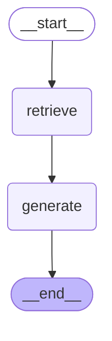

```mermaid
%%{init: {'flowchart': {'curve': 'linear'}}}%%
graph TD;
        __start__([<p>__start__</p>]):::first
        retrieve(retrieve)
        generate(generate)
        __end__([<p>__end__</p>]):::last
        __start__ --> retrieve;
        generate --> __end__;
        retrieve --> generate;
        classDef default fill:#f2f0ff,line-height:1.2;
        classDef first fill-opacity:0;
        classDef last fill:#bfb6fc;
```