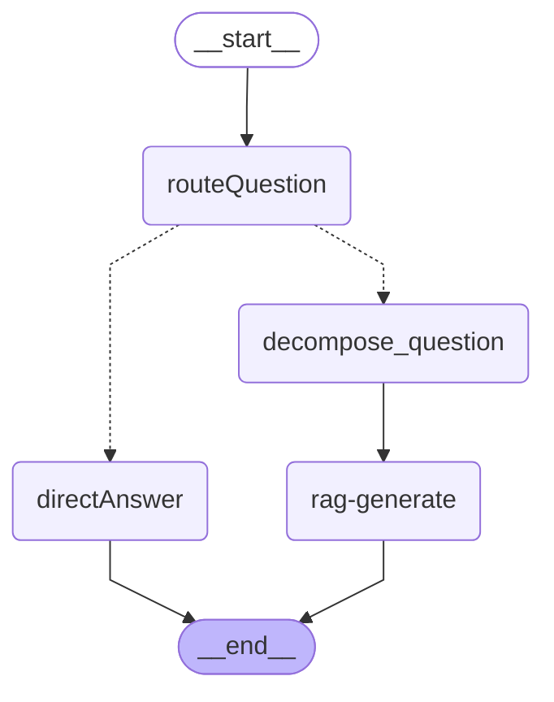

```mermaid
%%{init: {'flowchart': {'curve': 'linear'}}}%%
graph TD;
        __start__([<p>__start__</p>]):::first
        routeQuestion(routeQuestion)
        directAnswer(directAnswer)
        decompose_question(decompose_question)
        rag-generate(rag-generate)
        __end__([<p>__end__</p>]):::last
        __start__ --> routeQuestion;
        decompose_question --> rag-generate;
        directAnswer --> __end__;
        rag-generate --> __end__;
        routeQuestion -.-> directAnswer;
        routeQuestion -.-> decompose_question;
        classDef default fill:#f2f0ff,line-height:1.2;
        classDef first fill-opacity:0;
        classDef last fill:#bfb6fc;
```