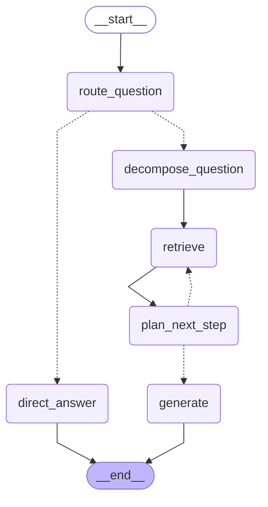
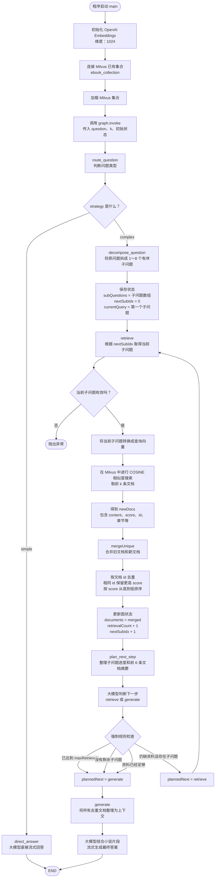

```mermaid
%%{init: {'flowchart': {'curve': 'linear'}}}%%
graph TD;
        __start__([<p>__start__</p>]):::first
        route_question(route_question)
        direct_answer(direct_answer)
        decompose_question(decompose_question)
        retrieve(retrieve)
        plan_next_step(plan_next_step)
        generate(generate)
        __end__([<p>__end__</p>]):::last
        __start__ --> route_question;
        decompose_question --> retrieve;
        direct_answer --> __end__;
        generate --> __end__;
        retrieve --> plan_next_step;
        route_question -.-> direct_answer;
        route_question -.-> decompose_question;
        plan_next_step -.-> retrieve;
        plan_next_step -.-> generate;
        classDef default fill:#f2f0ff,line-height:1.2;
        classDef first fill-opacity:0;
        classDef last fill:#bfb6fc;
```

完整流程图

```mermaid

flowchart TD
    A([程序启动 main]) --> B["初始化 OpenAI Embeddings<br/>维度：1024"]
    B --> C["连接 Milvus 已有集合<br/>ebook_collection"]
    C --> D["加载 Milvus 集合"]
    D --> E["调用 graph.invoke<br/>传入 question、k、初始状态"]

    E --> F["route_question<br/>判断问题类型"]
    F --> G{"strategy 是什么？"}

    G -->|"simple"| H["direct_answer<br/>大模型直接流式回答"]
    H --> Z([END])

    G -->|"complex"| I["decompose_question<br/>将原问题拆成 1～8 个有序子问题"]
    I --> I1["保存状态<br/>subQuestions = 子问题数组<br/>nextSubIdx = 0<br/>currentQuery = 第一个子问题"]

    I1 --> J["retrieve<br/>根据 nextSubIdx 取得当前子问题"]
    J --> J1{"当前子问题有效吗？"}

    J1 -->|"否"| ERR([抛出异常])
    J1 -->|"是"| K["将当前子问题转换成查询向量"]

    K --> L["在 Milvus 中进行 COSINE 相似度搜索<br/>取前 k 条文档"]
    L --> M["得到 newDocs<br/>包含 content、score、id、章节等"]

    M --> N["mergeUnique<br/>合并旧文档和新文档"]
    N --> N1["按文档 id 去重<br/>相同 id 保留更高 score<br/>按 score 从高到低排序"]

    N1 --> O["更新图状态<br/>documents = merged<br/>retrievalCount + 1<br/>nextSubIdx + 1"]

    O --> P["plan_next_step<br/>整理子问题进度和前 6 条文档摘要"]
    P --> Q["大模型判断下一步<br/>retrieve 或 generate"]

    Q --> R{"强制规则检查"}

    R -->|"已达到 maxRetrievals"| S["plannedNext = generate"]
    R -->|"没有剩余子问题"| S
    R -->|"资料已经足够"| S
    R -->|"仍缺资料且存在子问题"| T["plannedNext = retrieve"]

    T --> J

    S --> U["generate<br/>将所有去重文档整理为上下文"]
    U --> V["大模型结合小说片段<br/>流式生成最终答案"]
    V --> Z
```